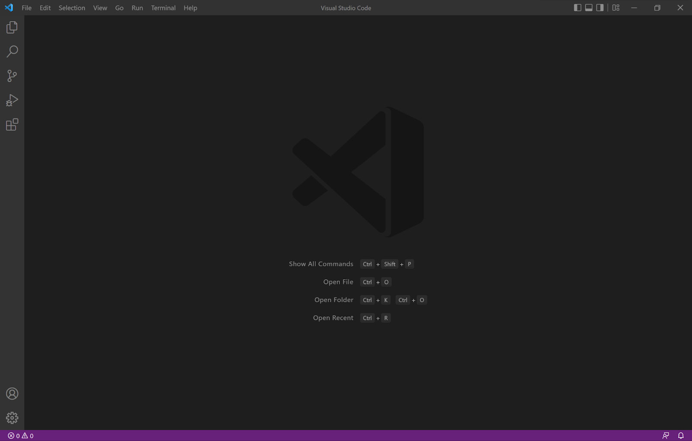
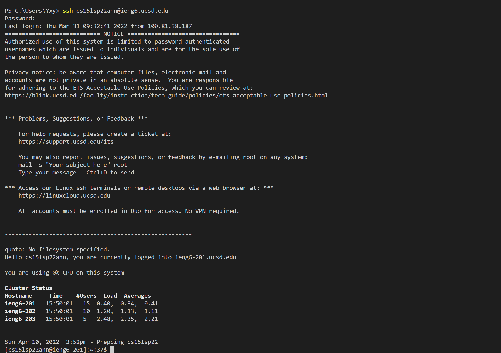
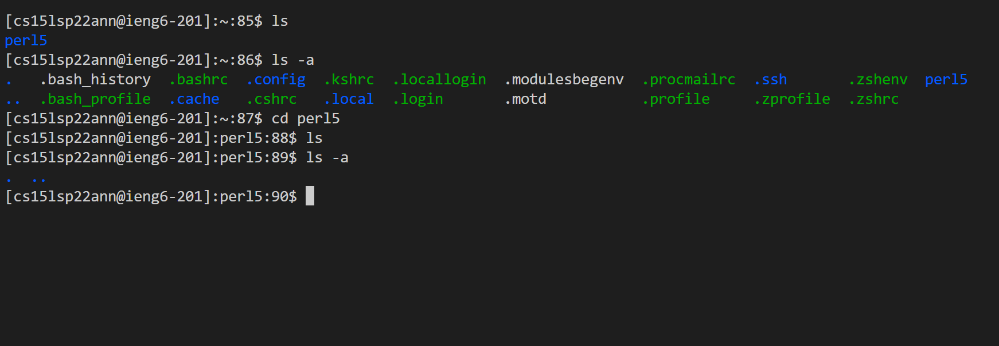
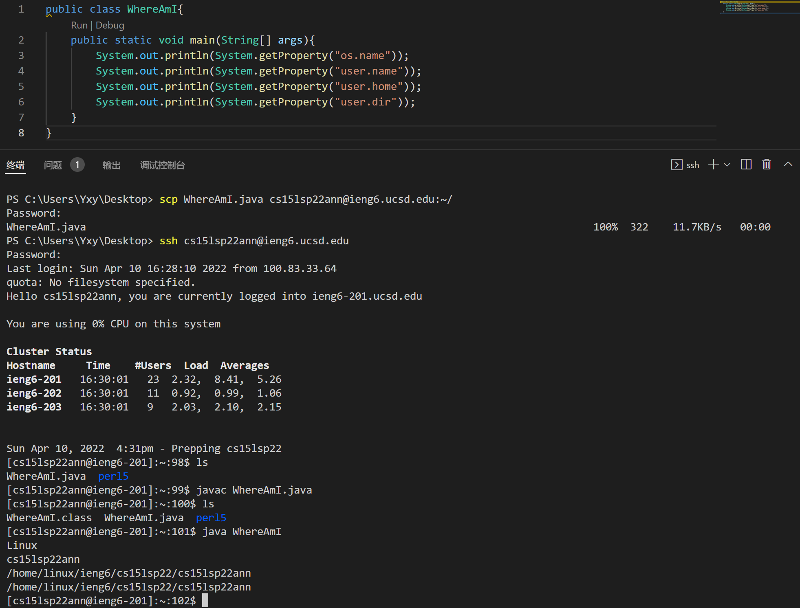

# Report 1
## Intro to CSE 15l
**Part 1: Installing Visual Studio Code**

This [link](https://code.visualstudio.com/) is the webside of the Visual Studio Code. You may follow the instructions to download and install it. Different systems have their own versions. After successfully Installed it, you may open a window looks like the following:

If you successfully get a window that looks like it, you may have successfully installed the VS Code.

**Part 2: Remotely Connecting**

For Windows, you may have to install a program called [OpenSSH](https://docs.microsoft.com/en-us/windows-server/administration/openssh/openssh_install_firstuse) first.

Then, for this course (CSE 15L Spring 2022), we may find the account [here](https://sdacs.ucsd.edu/~icc/index.php) (and it may not work in the future). And for reference, [this](https://code.visualstudio.com/docs/remote/ssh#_connect-to-a-remote-host) may be useful.

Open a terminal first (Ctrl + `, or just click terminal at the top). The following shows what I've done and also some result.

By using the ssh command and the specific account (for my course, everyone should replace the `ann`, which is my own account, to there own), and then type in the password (which is totally hidden for safety and so just correctly type in it even if you can't see it), you may ysee similar message as mine above. This means you have successfully connect the terminal with the server in the CSE basement, and you may run some commands on that computer now.

**Part 3: Trying Some Command**

Here are some commands that I've tried through the terminal:

Here `ls` may list all the files and `ls -a` may list all the files including the hidden files. `cd` may goes to a specific directory. 
Though I did not try it in the graph, `pwd` may show the directory where you are, and `rm` may remove a file.

**Part 4: Moving Files with SCP**

The picture above shows the file and also the code in the file that I copied to the server by using `scp`. Then I also used `javac` and `java` to compile and run the code on the server to get some information.

**Part 5: SSH Keys**

