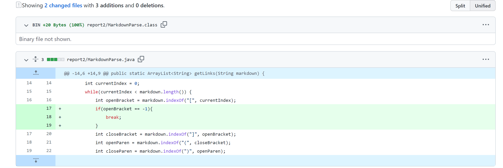
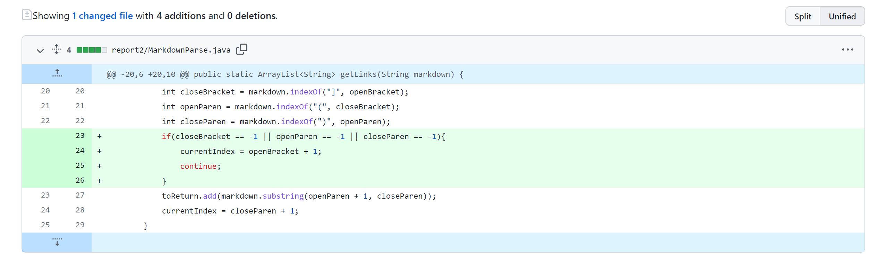
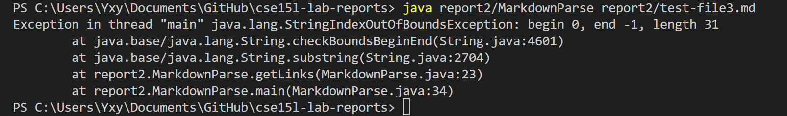
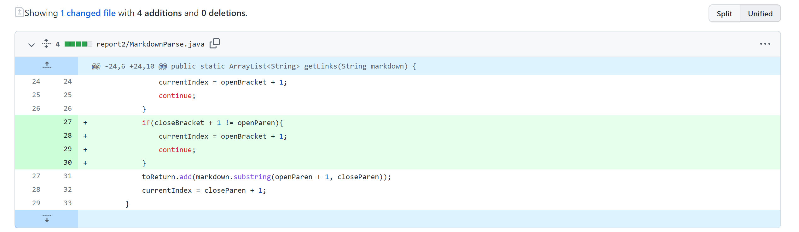
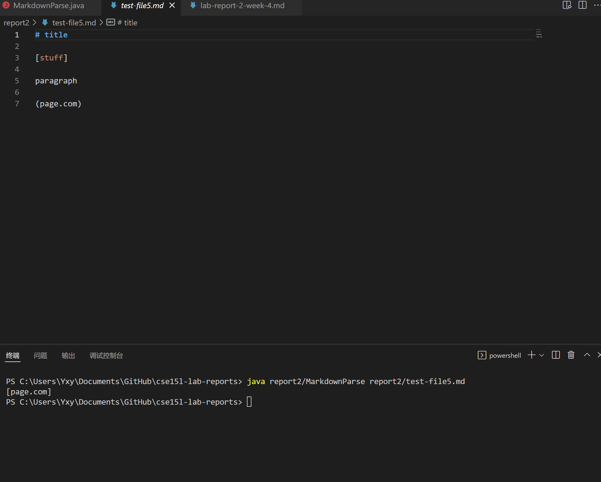

# Report 2
## Debug MarkdownParse
**Code Change 1**

First change:

First failure file [here](test-file.md)

First symptom below:

This is caused by an infinite loop. Since the `indexOf` method return -1 if the required string is not found. So I change the code and check if it gets -1. And if it is -1, then break the loop.

**Code Change 2**

Second change:

Second failure file [here](test-file3.md)

Second symptom below:

This is caused since bracket can be found but parenthesis cannot. So I decide to check the closeBracket, the openParen, and the closeParen. If one of them is -1, then directly go to the next loop with currentIndex go to openBracket + 1 in order to get the next openBracket.

**Code Change 3**

Third change:

Third failure file [here](test-file5.md)

Third symptom below:

This is caused by the bracket and the parenthesis are not adjacent. So I change the code and check whether the closeBracket is just before the openParen. If it is, get the link. If it is not, continue to the next loop with currentIndex go to openBracket + 1 in order to get the next openBracket.

---

All changes has completed here.