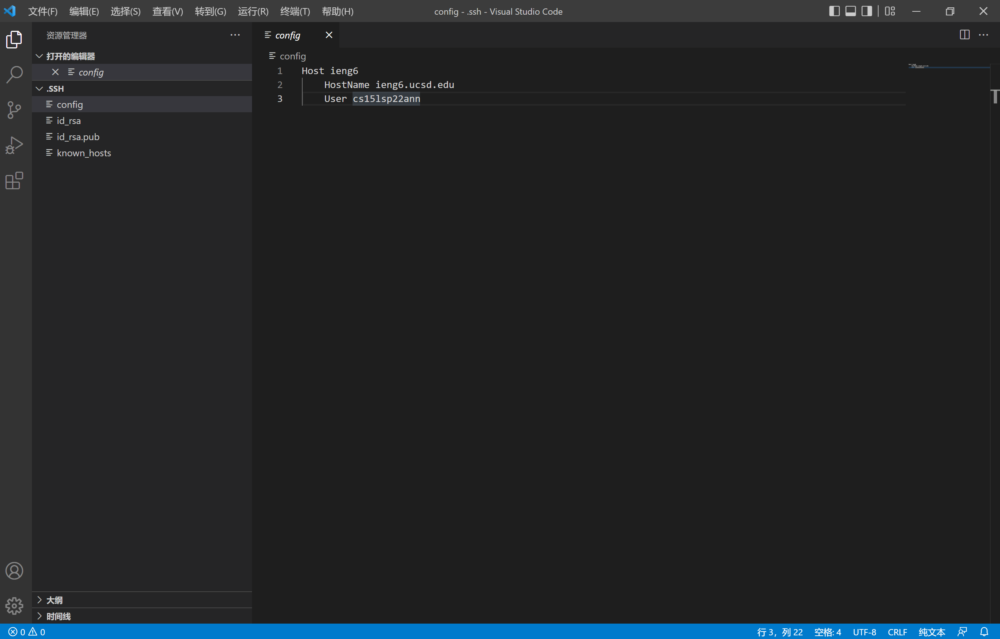
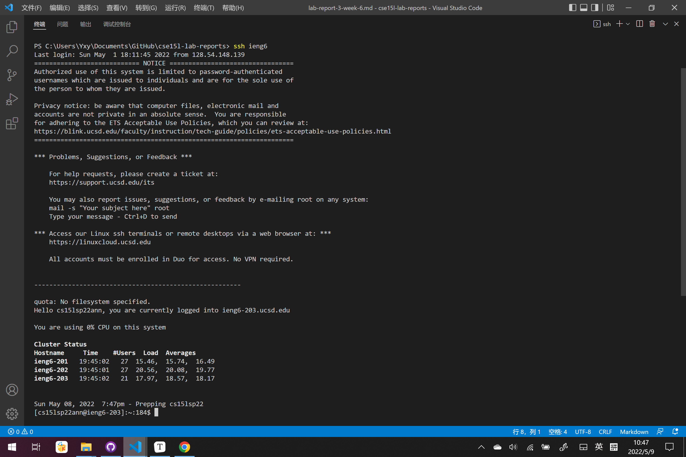

# Report 3
## All Group Choice Options (1-3) from Lab 5
**Streamlining ssh Configuration**
So first I create and edit the config file in .ssh by using VSCode shown below.

Thus now I can use ssh and scp commands directly.
The ssh command results here below.

The scp that copy a file to the server results here below.
F

