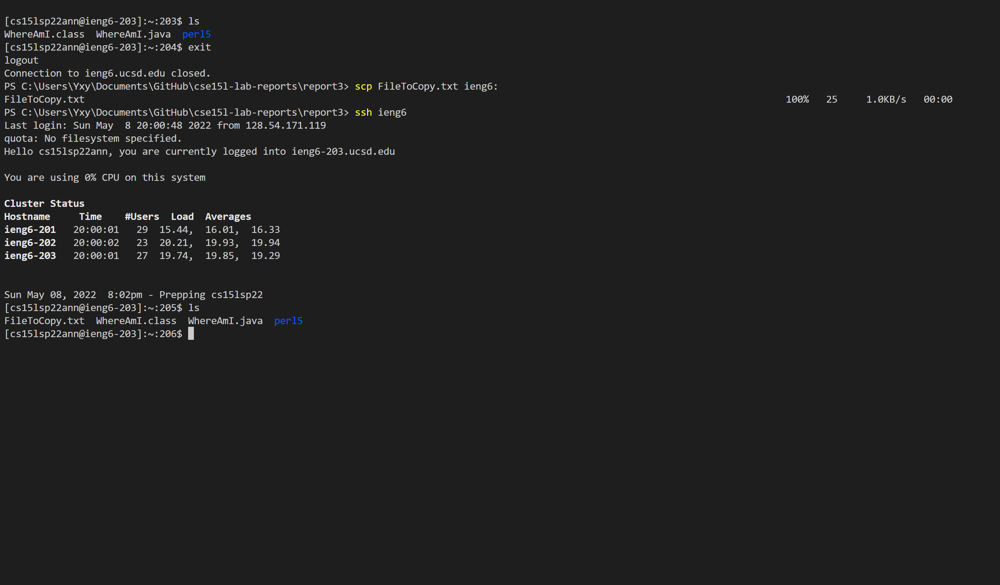
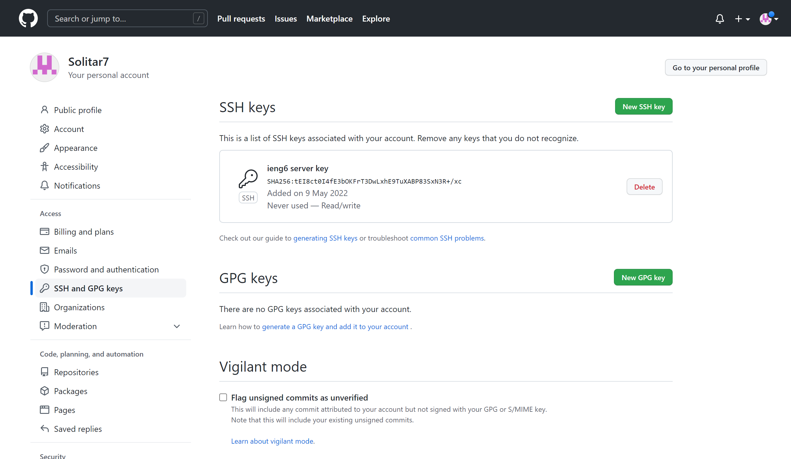
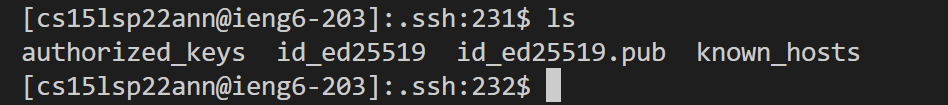

# Report 3
## All Group Choice Options (1-3) from Lab 5
**Streamlining ssh Configuration**

So first I create and edit the config file in .ssh by using VSCode shown below.

Thus now I can use ssh and scp commands directly.
The ssh command results here below.

The scp that copy a file to the server results here below.

Here we can see that the top ls shows the existing files inside. Then by using the scp command and the local computer (my own computer), and then use ssh command to log into the server and use ls to check again, we can find that the copied file appears on the server.

**Setup Github Access from ieng6**

Here is public key on github.

Here is keys on server

**Copy whole directories with scp -r**

