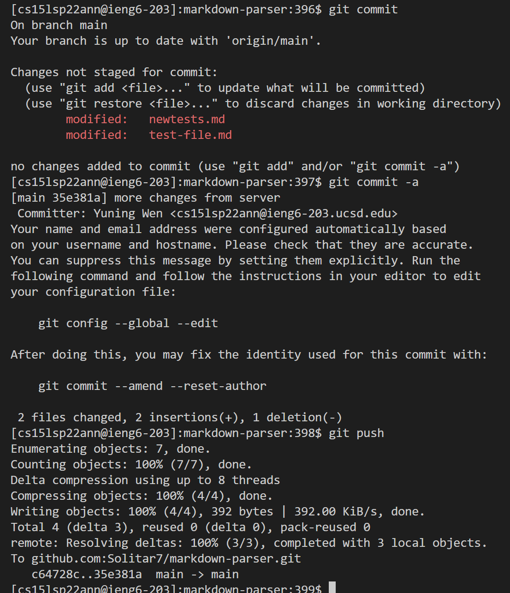
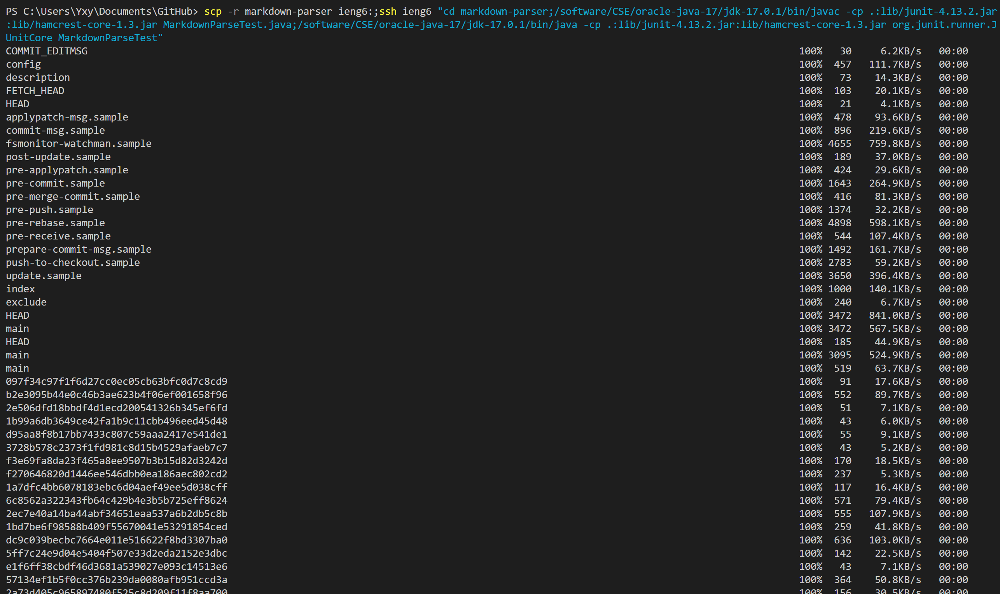
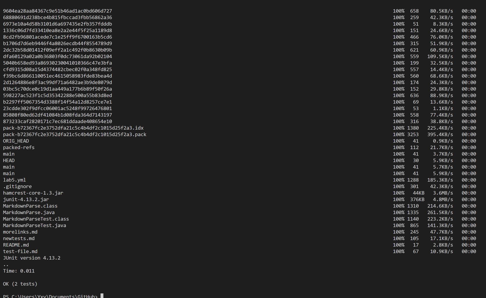

# Report 3
## All Group Choice Options (1-3) from Lab 5
**Streamlining ssh Configuration**

So first I create and edit the config file in .ssh by using VSCode shown below.

Thus now I can use ssh and scp commands directly.
The ssh command results here below.

The scp that copy a file to the server results here below.

Here we can see that the top ls shows the existing files inside. Then by using the scp command and the local computer (my own computer), and then use ssh command to log into the server and use ls to check again, we can find that the copied file appears on the server.

**Setup Github Access from ieng6**

Here is keys on server, I uses keygen with rsa encode to get the keys and thus may copy the key and add it as public key on github.

Here is public key on github.

Then I made a clone and made some changes (not shown), then commit and push it back just like shown below.

The link to this commit is [here](https://github.com/Solitar7/markdown-parser/commit/35e381a43b12cc5b07a4b4b8c25901f9a8374cf7).

**Copy whole directories with scp -r**

Now I need to copy the whole directory of markdown-parser.

Though there are a lot of files, they are still all copied (not all shown in the graph).
Then I get on the server and compile and run the test.

We can see first some copied files on the top of this screenshot and then also test runs successfully.
Now, I'm going to run all the commands in one line.

From the two pictures above, I successfully copy all the files to the server and then directly log into the server and then compile and run all the codes. The result of the test shown is also good.

