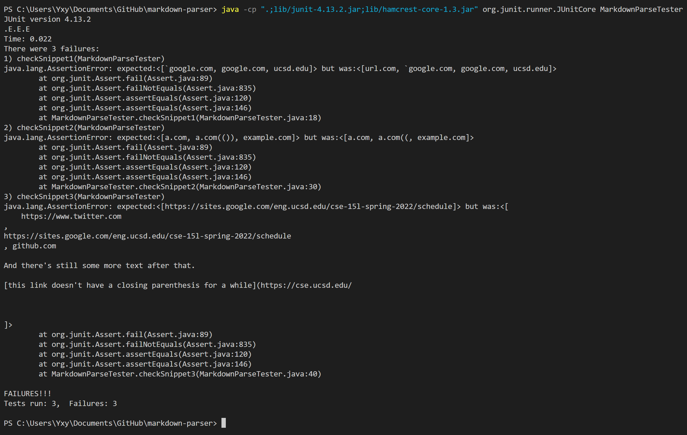

# Report 4
## Link to repositories

My markdown-parse repository is [here](https://github.com/Solitar7/markdown-parser)

The markdown-parse repository I reviewed is [here](https://github.com/ednavho/ednafiles)

## Expected Result
For Snippet1, I expect to get [`google.com, google.com, ucsd.edu] as output.

For Snippet2, I expect to get [a.com, a.com(()), example.com] as output.

For Snippet3, I expect to get [https://sites.google.com/eng.ucsd.edu/cse-15l-spring-2022/schedule] as output.

## My tester for the Markdown-Parse
The tester code I write is in my repository above, and the screenshot of the code is here below.

## Result from tester on my implementation
For my implementation, I have the following output, which are actually all wrong. 

For Snippet1, I expect to get [\`google.com, google.com, ucsd.edu] as output, but get [url.com, \`google.com, google.com, ucsd.edu], which is not matched.

For Snippet2, I expect to get [a.com, a.com(()), example.com] as output, but get [a.com, a.com((, example.com], which is also not matched.

For Snippet3, I expect to get [https://sites.google.com/eng.ucsd.edu/cse-15l-spring-2022/schedule] as output, but get [
    https://www.twitter.com
,
https://sites.google.com/eng.ucsd.edu/cse-15l-spring-2022/schedule
, github.com

And there's still some more text after that.

[this link doesn't have a closing parenthesis for a while](https://cse.ucsd.edu/

] as result, which is not only a mess but also not matched at all.

## Result from tester on the repository I reviewed in Week 7
Then, for the implementation I reviewed in Week 7, I also have the same expected result, and I use the same tester on it. Then I get the following result.