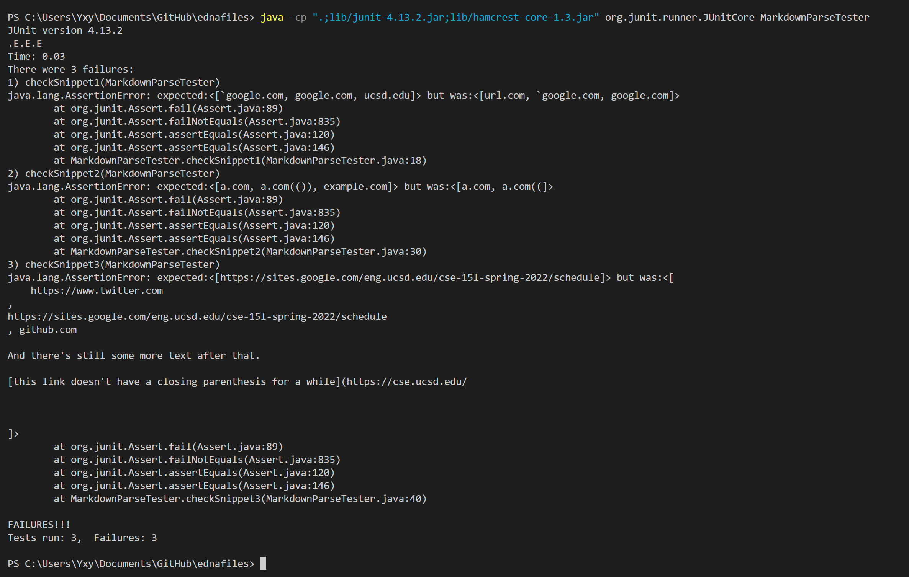

# Report 4
## Link to repositories

My markdown-parse repository is [here](https://github.com/Solitar7/markdown-parser)

The markdown-parse repository I reviewed is [here](https://github.com/ednavho/ednafiles)

## Expected Result

For Snippet1, I expect to get [`google.com, google.com, ucsd.edu] as output.

For Snippet2, I expect to get [a.com, a.com(()), example.com] as output.

For Snippet3, I expect to get [https://sites.google.com/eng.ucsd.edu/cse-15l-spring-2022/schedule] as output.

## My tester for the Markdown-Parse

The tester code I write is in my repository above, and the screenshot of the code is here below.

## Result from tester on my implementation

For my implementation, I have the following output, which are actually all wrong. 

For Snippet1, I expect to get [\`google.com, google.com, ucsd.edu] as output, but get [url.com, \`google.com, google.com, ucsd.edu], which is not matched.

For Snippet2, I expect to get [a.com, a.com(()), example.com] as output, but get [a.com, a.com((, example.com], which is also not matched.

For Snippet3, I expect to get [https://sites.google.com/eng.ucsd.edu/cse-15l-spring-2022/schedule] as output, but get [
    https://www.twitter.com
,
https://sites.google.com/eng.ucsd.edu/cse-15l-spring-2022/schedule
, github.com

And there's still some more text after that.

[this link doesn't have a closing parenthesis for a while](https://cse.ucsd.edu/

] as result, which is not only a mess but also not matched at all.

## Result from tester on the repository I reviewed in Week 7

Then, for the implementation I reviewed in Week 7, I also have the same expected result, and I use the same tester on it. Then I get the following result.

For Snippet1, I expect to get [\`google.com, google.com, ucsd.edu] as output, but get [url.com, `google.com, google.com], which is not matched.

For Snippet2, I expect to get [a.com, a.com(()), example.com] as output, but get [a.com, a.com((], which is also not matched.

For Snippet3, I expect to get [https://sites.google.com/eng.ucsd.edu/cse-15l-spring-2022/schedule] as output, but get [
    https://www.twitter.com
,
https://sites.google.com/eng.ucsd.edu/cse-15l-spring-2022/schedule
, github.com

And there's still some more text after that.

[this link doesn't have a closing parenthesis for a while](https://cse.ucsd.edu/

] as result, which is not only a mess but also not matched at all.

## Changes to make for my implementation 
For Snippet1, I think I can simply add check for each line to see if there are some words between two \`, and extract them out of the original string, or in other words, combine the substring before the first \` and the substring after the second \`, and then run the parser on the rest combined string. 

For Snippet2, I think a small code change cannot make my program work for it. I think that using a stack for all the [] and () and \` and other relevant things may finally make it a successful code. This is a big change, since I need to check the stack whenever I get a ). If I match up a [] and then several (), I should stop and print the link when the top is no longer (, since it means that this is the closest () after []. Then I check the index and other relevant information to see if it is a relevant link. However, this is not a small code change at all. 

For Snippet3, I think I can simply check for spaces and \n for the links I get. If there are these things inside, I should not print out this link since it is an invalid link. 

All in all, I think that if I implement the stack method for Snippet2 correctly and also check the link printed correctly, this parser implemented by stack should work well.