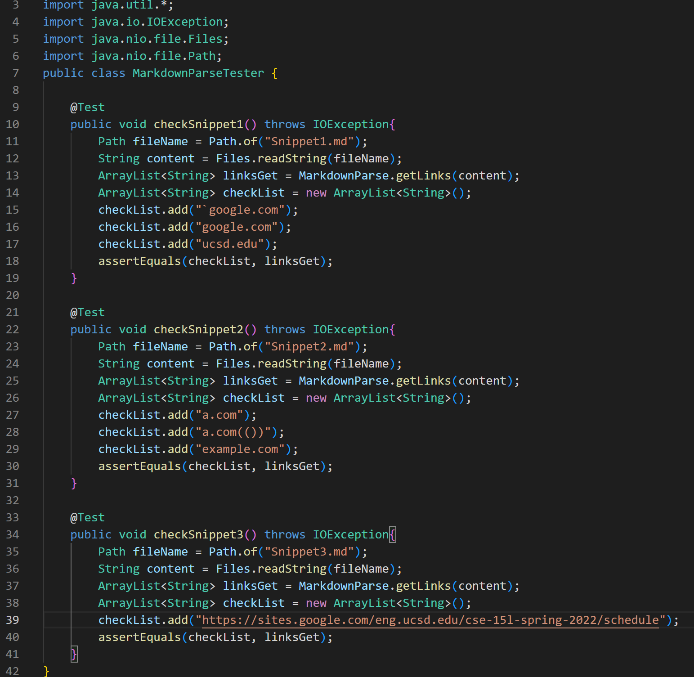

# Report 4

My markdown-parse repository is [here](https://github.com/Solitar7/markdown-parser)

The markdown-parse repository I reviewed is [here](https://github.com/ednavho/ednafiles)

For Snippet1, I expect to get [`google.com, google.com, ucsd.edu] as output.

For Snippet2, I expect to get [a.com, a.com(()), example.com] as output.

For Snippet3, I expect to get [https://sites.google.com/eng.ucsd.edu/cse-15l-spring-2022/schedule] as output.

The tester code I write is in my repository above, and the screenshot of the code is here below.

For my implementation, I have the following output, which are actually all wrong. 
