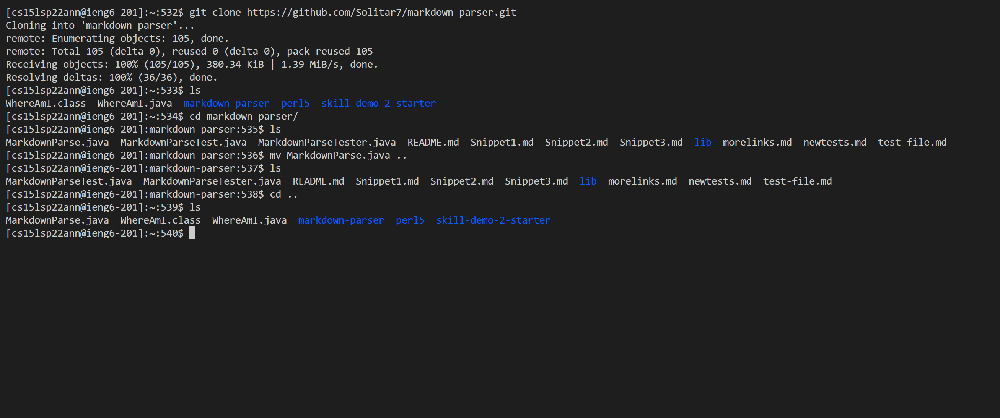
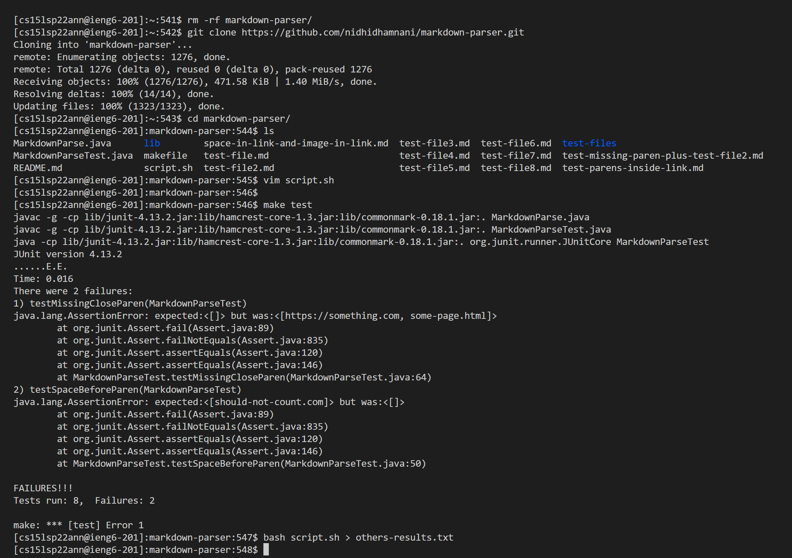

# Report 5
## Tests with different results

First of all, I clone the provided repositary to the server and produce results from the given code first, and then remove the MarkdownParse.java and copy my own MarkdownParse.java into the directory to run and produce results from my own code. Then, I use vimdiff and also manually check the difference between the two results.

Here above I first get my own parser to the server. 

Then I delete my file and copy the provided repositary and first edit the script.sh file in order to print all the names of the files, and then use make test in a quick way to set all the things, and finally run script.sh and put the result into the file named others-results.txt.

After that, I remove both .class file and replace the MarkdownParse.java file in order to use make test again to quickly set all the things ready.

