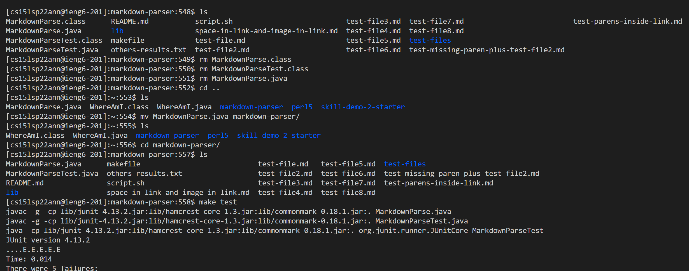
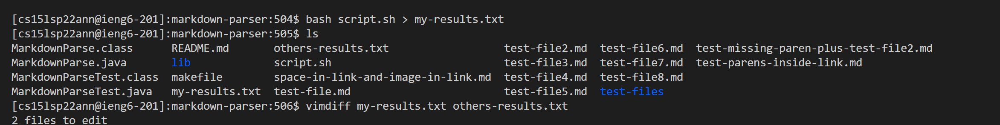
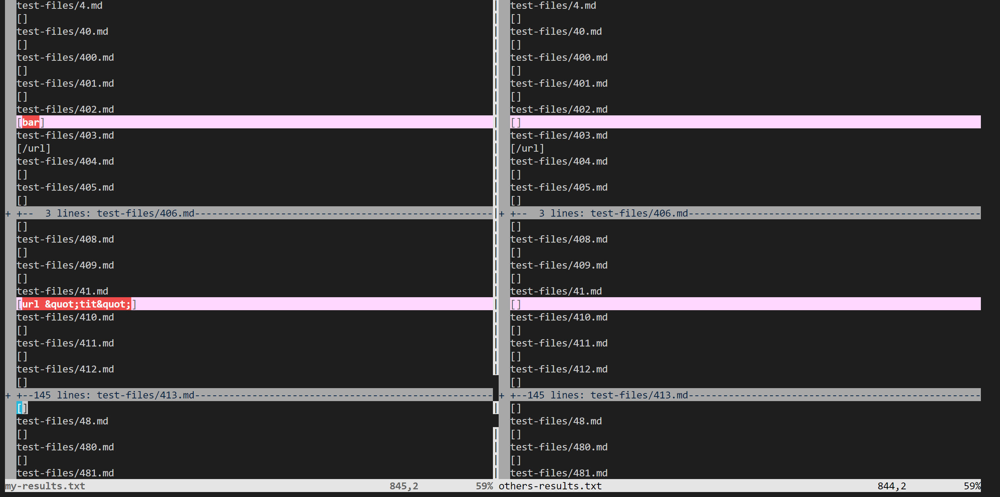
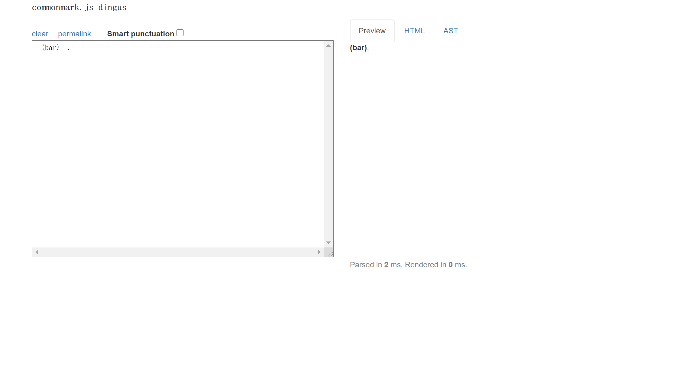
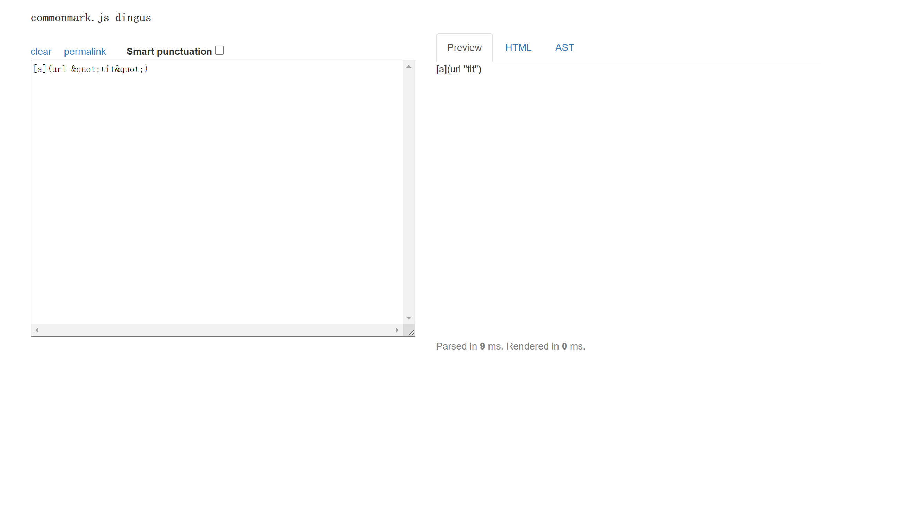

# Report 5
## Tests with different results

First of all, I clone the provided repositary to the server and produce results from the given code first, and then remove the MarkdownParse.java and copy my own MarkdownParse.java into the directory to run and produce results from my own code. Then, I use vimdiff and also manually check the difference between the two results.

Here above I first get my own parser to the server. 

Then I delete my file and copy the provided repositary and first edit the script.sh file in order to print all the names of the files, and then use make test in a quick way to set all the things, and finally run script.sh and put the result into the file named others-results.txt.

After that, I remove both .class file and replace the MarkdownParse.java file in order to use make test again to quickly set all the things ready.

Then, I can create my results from my parser and use vimdiff to check difference now, with part of the different the results shown below.

Here are the links to the two files that have different results:

[402.md](https://github.com/nidhidhamnani/markdown-parser/edit/main/test-files/402.md)

[41.md](https://github.com/nidhidhamnani/markdown-parser/edit/main/test-files/41.md)

Now two different files need to be discussed separately.

**402.md**

From the website, we can found that it is not a link, thus according to the pictures above, my result is wrong, which means my implementation is wrong. The actual output should be [] with nothing inside.

I think that I can fix my code by checking if there is [] before () to get a correct link, since a link in () must have [] just before it.

**41.md**

From the website, we can found that it is not a link, thus according to the pictures above, my result is wrong again, which means my implementation is wrong again. The actual output should still be [] with nothing inside.

But for this time, I think the way to fix my code is to first fix the bug above, then add one more check to see if there is "" inside [], while "" may or may not have text in between.

